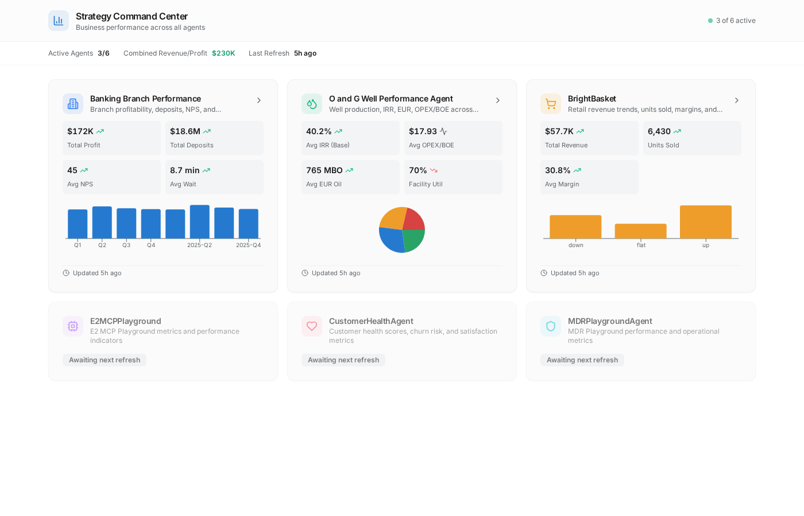
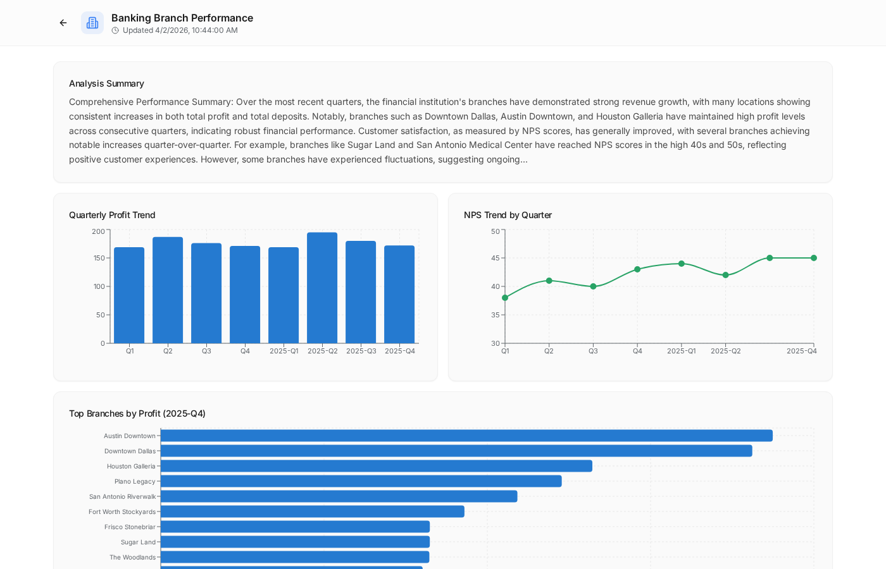
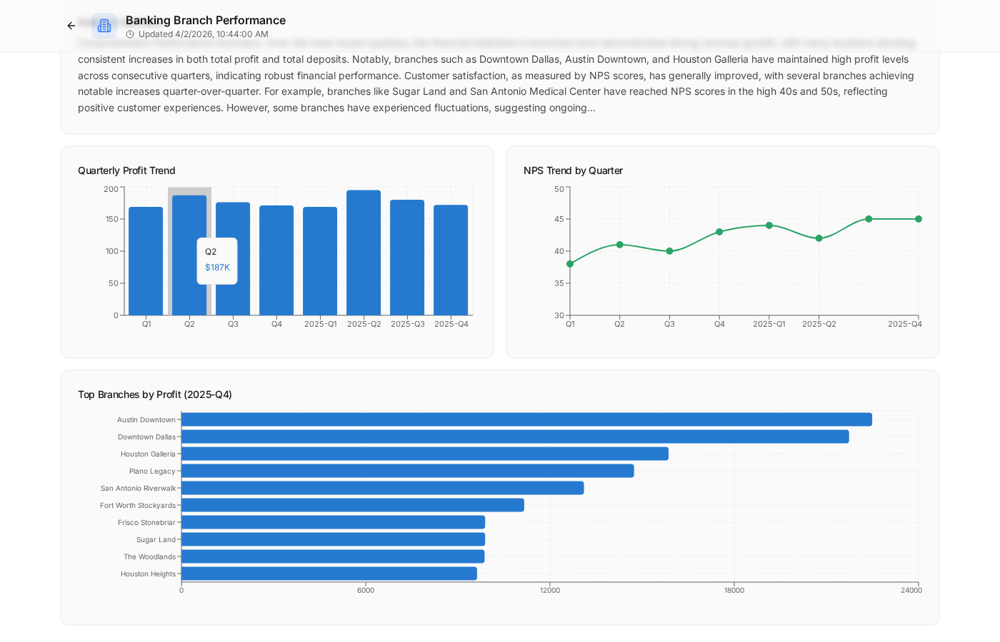
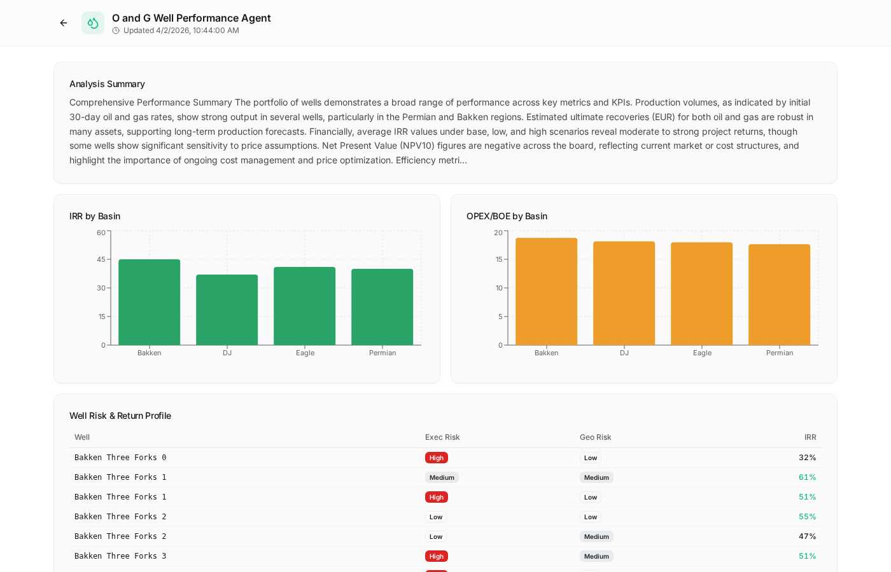
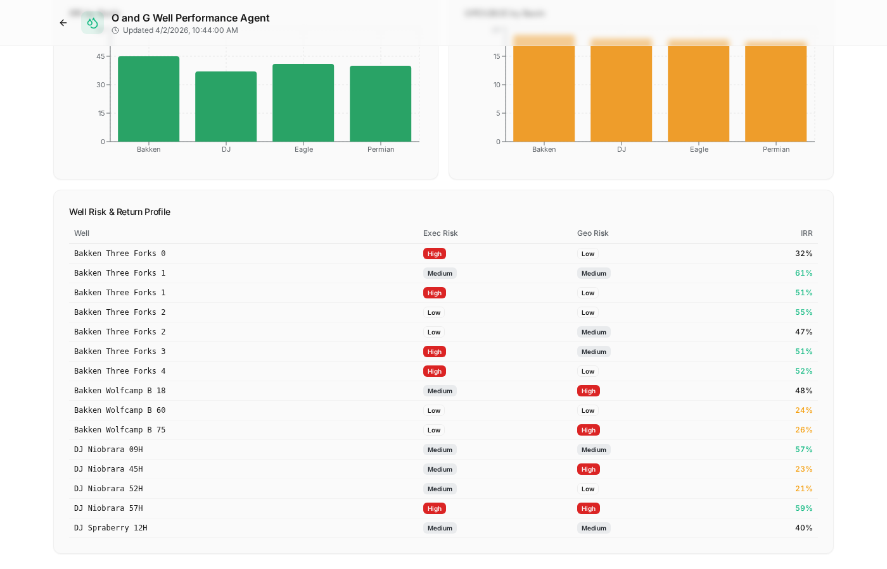
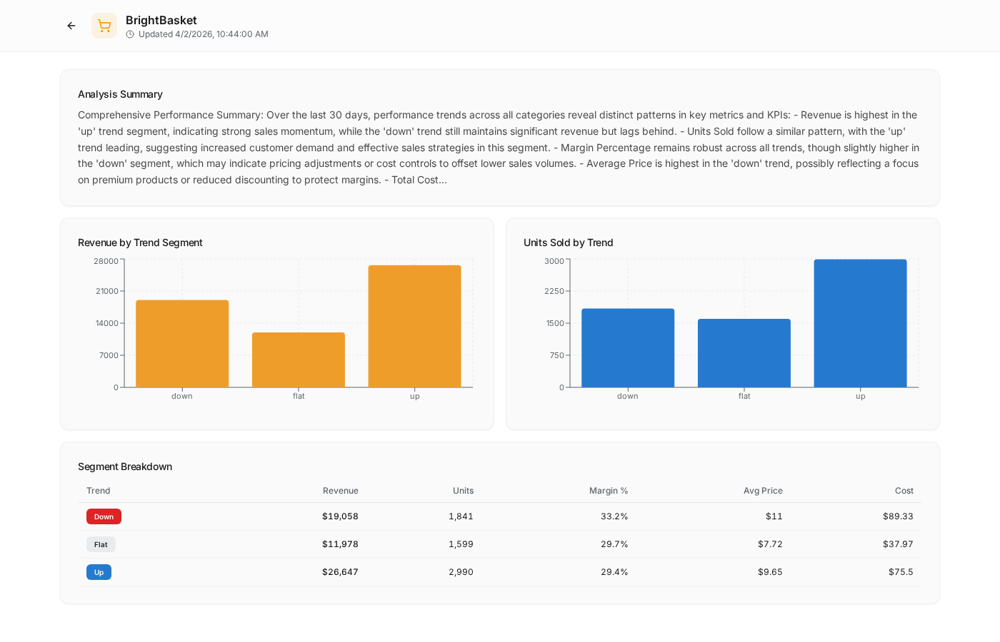

# Strategy Command Center

A real-time business performance dashboard that aggregates data from multiple MicroStrategy AI agents via the Strategy MCP (Model Context Protocol) connector. Built with Express, React, Tailwind CSS, Recharts, and SQLite.

## Demo

https://github.com/tzockoll-creator/StrategyCommandCenterPerplexityComputer/raw/main/demo-assets/demo.mp4

> The demo video above walks through the main dashboard and drill-down views. If the video doesn't render inline, [download it here](demo-assets/demo.mp4) or see the screenshots below.

## Screenshots

### Dashboard Overview

The main view shows KPI cards for each connected business agent with mini-charts, trend indicators, and a combined summary bar.



### Banking Branch Performance

Drill into 15+ Texas branch locations with quarterly profit trends, NPS tracking, and a ranked branch comparison.





### O&G Well Performance

Analyze 75 wells across Bakken, DJ, Eagle Ford, and Permian basins. View IRR by basin, OPEX/BOE comparisons, and a risk/return matrix with execution and geological risk ratings.





### BrightBasket Retail

Revenue and unit trends segmented by up/down/flat momentum, with margin analysis and pricing breakdowns.



## Architecture

```
┌──────────────────────────────────────────────────────────┐
│                   Strategy Command Center                │
├──────────────────────────────────────────────────────────┤
│                                                          │
│  ┌─────────────┐   ┌──────────────┐   ┌──────────────┐  │
│  │  React +    │   │   Express    │   │   SQLite     │  │
│  │  Recharts   │◄──│   API        │◄──│   (Drizzle)  │  │
│  │  Frontend   │   │   Server     │   │   Storage    │  │
│  └─────────────┘   └──────┬───────┘   └──────────────┘  │
│                           │                              │
└───────────────────────────┼──────────────────────────────┘
                            │
                   ┌────────▼────────┐
                   │  Strategy MCP   │
                   │  Connector      │
                   └────────┬────────┘
                            │
          ┌─────────────────┼─────────────────┐
          │                 │                 │
    ┌─────▼─────┐   ┌──────▼──────┐   ┌─────▼─────┐
    │  Banking  │   │  O&G Well   │   │  Bright   │
    │  Branch   │   │  Perf Agent │   │  Basket   │
    │  Agent    │   │             │   │  Agent    │
    └───────────┘   └─────────────┘   └───────────┘
         ...plus 3 additional agents
```

### MicroStrategy Agents

| Agent | Domain | Key Metrics |
|-------|--------|-------------|
| **Banking Branch Performance** | Financial services | Profit, deposits, NPS, wait times, transactions/FTE |
| **O&G Well Performance** | Energy | IRR, OPEX/BOE, EUR (oil/gas), facility utilization, risk |
| **BrightBasket** | Retail | Revenue, units sold, margin %, avg price, trend segments |
| **E2MCPPlayground** | Experimental | General metrics and KPIs |
| **CustomerHealthAgent** | Customer success | Health scores, churn risk, satisfaction |
| **MDRPlaygroundAgent** | Operations | MDR performance and efficiency |

## Tech Stack

| Layer | Technology |
|-------|-----------|
| **Frontend** | React 18, Tailwind CSS, shadcn/ui, Recharts, Wouter |
| **Backend** | Express.js, Node.js |
| **Database** | SQLite via better-sqlite3 + Drizzle ORM |
| **Data Source** | MicroStrategy MCP (Model Context Protocol) |
| **Build** | Vite, TypeScript, esbuild |
| **Scheduling** | Perplexity Computer cron (daily refresh at 7 AM CDT) |

## Project Structure

```
strategy-dashboard/
├── client/
│   └── src/
│       ├── App.tsx                 # Router setup
│       ├── pages/
│       │   ├── dashboard.tsx       # Main overview with agent cards
│       │   └── agent-detail.tsx    # Drill-down with charts/tables
│       ├── components/ui/          # shadcn/ui components
│       └── index.css               # Tailwind + theme variables
├── server/
│   ├── routes.ts                   # API endpoints
│   ├── storage.ts                  # Database operations
│   ├── db.ts                       # SQLite/Drizzle setup
│   └── index.ts                    # Express server
├── shared/
│   └── schema.ts                   # Drizzle schema + Zod types
├── demo-assets/                    # Screenshots and demo video
└── package.json
```

## Getting Started

### Prerequisites

- Node.js 18+
- npm

### Installation

```bash
git clone https://github.com/tzockoll-creator/StrategyCommandCenterPerplexityComputer.git
cd StrategyCommandCenterPerplexityComputer
npm install
```

### Development

```bash
npm run dev
```

The app runs on `http://localhost:5000` with hot reloading.

### Production Build

```bash
npm run build
NODE_ENV=production node dist/index.cjs
```

### Seeding Data

The dashboard accepts data via its REST API. Post agent snapshots:

```bash
curl -X POST http://localhost:5000/api/seed \
  -H "Content-Type: application/json" \
  -d '{
    "agents": [{
      "agentId": "AGENT_UUID",
      "agentName": "Agent Display Name",
      "summary": "Performance summary text...",
      "chartDataJson": "{\"charts\": [...]}",
      "fetchedAt": "2026-04-02T12:00:00Z"
    }]
  }'
```

## API Endpoints

| Method | Path | Description |
|--------|------|-------------|
| `GET` | `/api/snapshots` | Latest snapshot for each agent |
| `GET` | `/api/snapshots/:agentId` | Historical snapshots for one agent |
| `POST` | `/api/seed` | Insert new agent snapshots |

## How It Works

1. **Data Collection**: A scheduled task queries each MicroStrategy agent via the Strategy MCP connector, asking for a comprehensive performance summary with chart data.

2. **Storage**: Responses are parsed into structured snapshots (text summary + chart JSON) and stored in SQLite. Historical snapshots are preserved for trend analysis.

3. **Visualization**: The React frontend renders agent-specific dashboards:
   - Banking: Quarterly profit bars, NPS line trends, branch rankings
   - O&G: Basin-level IRR/OPEX comparisons, well risk matrix
   - Retail: Revenue/units by trend segment, margin tables

4. **Daily Refresh**: A Perplexity Computer cron job runs at 7 AM CDT, queries all agents sequentially (respecting the MicroStrategy API's one-at-a-time processing limit), and updates the dashboard.

## License

MIT
